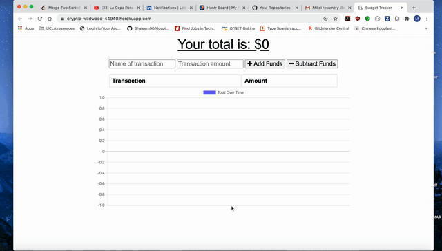

# Budget Tracker

[Link to App](https://glacial-caverns-54725.herokuapp.com/)

Client side application that records Budget transactions.

# Technology Used

> 1. Javascript
> 2. Nodejs
> 3. MongoDB
> 4. Expressjs
> 5. Morgan
> 6. HTML
> 7. CSS

# Table of Contents

- [Instructions](#instructions)
- [Example Gif](#example-gif)
- [Contributors](#contributors)
- [Acknowledgements](#acknowlegments)
- [Author](#author)

## Instructions

> In your browser, navigate to https://glacial-caverns-54725.herokuapp.com/. When the window opens, Begin by depositing funds to the Budget tracker. You will not see the funds or graph change after the initial deposit, however, funds are there. Then, begin to deduct funds as needed, you will see the app change funds and graph after the first deduction. Application will work even if offline. Once back online, the app will adjust funds for whatever transactions were run while online.

# Example Gif:

## Contributors

[musicman785](http://github.com/musicman785)

## Author

**musicman785**

Email: null

Location: Los Angeles

Github: https://github.com/musicman785